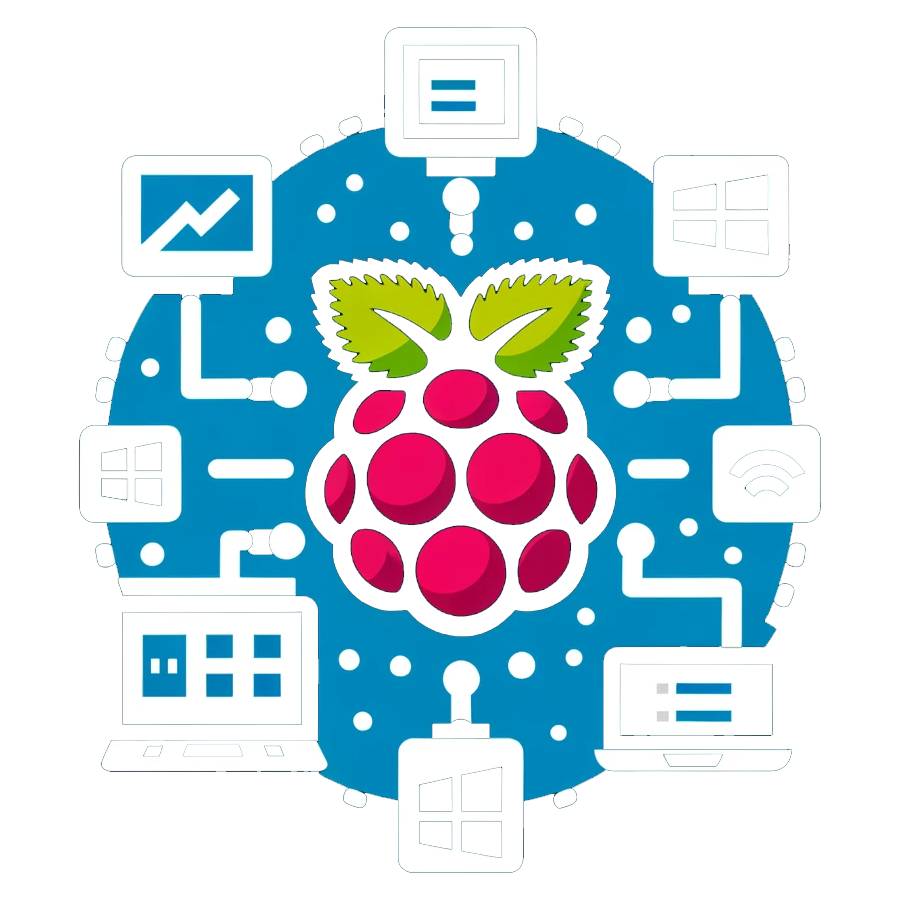

<p align="center"></p>

# PyRDPConnect


## Description
`PyRDPConnect` is a remote desktop client based on FreeRDP 2. It is a front-end for thin-clients.

## Features
  - Support Microsoft RDP Connections (Windows Terminal Server and Direct Connection)

## Planned
  - Support for openVPN

## License
This software is distributed under the [MIT](LICENSE) license.

## Requirements
* Python >= 3.0

## Security
Please disclose any vulnerabilities found responsibly – report security issues to the maintainers privately. See [SECURITY.md](SECURITY.md) for more information.

## Installation
Using Composer:
```sh
composer require laswitchtech/PyRDPConnect
```

## How do I use it?
Review the [Documentation](docs/).
